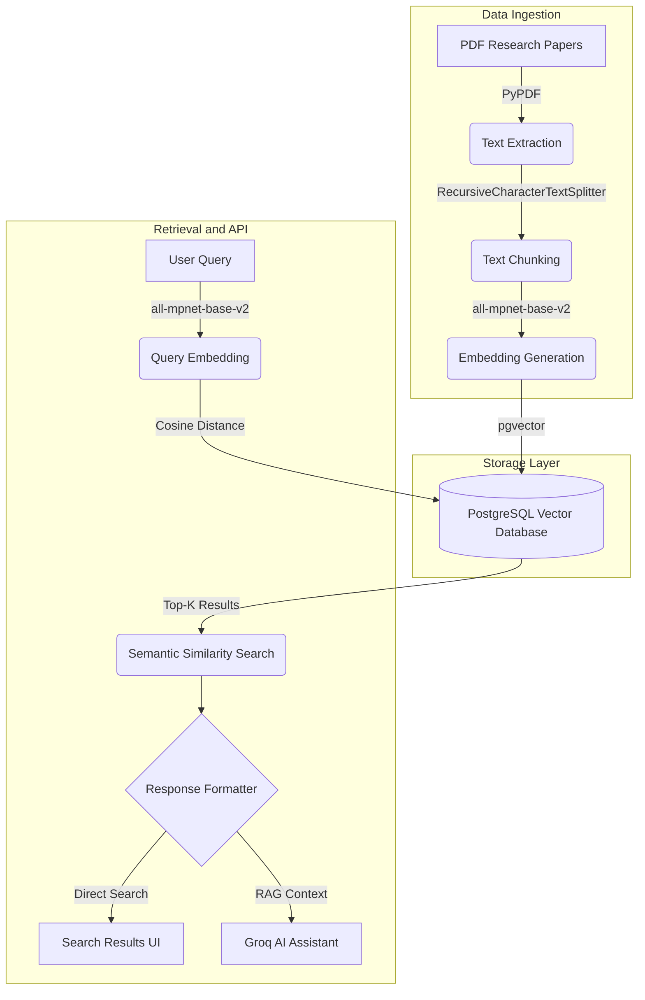

# AI Research Paper Semantic Search System

[](https://www.python.org/downloads/)
[](https://www.postgresql.org/)
[](https://fastapi.tiangolo.com/)

A production-ready semantic search engine for research papers using vector embeddings, FastAPI, and PostgreSQL with the pgvector extension.

## Quick Start

```bash
# 1. Install dependencies
pip install -r requirements.txt

# 2. Configure .env with your Groq API key
echo "GROQ_API_KEY=your_key_here" > .env

# 3. Setup database
python main.py setup

# 4. Ingest papers
python main.py ingest

# 5. Start the web UI and API
python main.py api
# Application runs on http://localhost:8000
```

## Table of Contents

- [Project Overview](#project-overview)
- [System Architecture](#system-architecture)
- [Technology Stack](#technology-stack)
- [Installation](#installation)
- [Usage](#usage)
- [API Documentation](#api-documentation)
- [Project Structure](#project-structure)

## Project Overview

This project implements a semantic search engine designed specifically for academic and scientific research papers. Instead of traditional keyword-based search mechanisms, the system enables meaning-based retrieval utilizing dense vector embeddings and similarity metrics. 

The application processes PDF research papers, extracts and chunks text, converts the textual content into high-dimensional vector embeddings, and stores them in a PostgreSQL database augmented with pgvector. The semantic retrieval system is coupled with a RAG-powered interactive conversational assistant.

### Key Capabilities

- **Semantic Understanding**: Retrieve papers based on semantic meaning rather than exact keyword matches.
- **Fast Retrieval**: Sub-second search across thousands of documents utilizing vector indexing.
- **Scalable Storage**: Reliable storage through PostgreSQL.
- **REST API**: Simplified integration with external applications.
- **Conversational AI**: Context-aware interactions utilizing Groq AI models.

## System Architecture

The following diagram illustrates the data flow and system architecture:



## Technology Stack

| Component | Technology |
|-----------|-----------|
| **Language** | Python 3.8+ |
| **Framework** | FastAPI |
| **Database** | PostgreSQL 12+ |
| **Vector Extension** | pgvector |
| **Embeddings** | Sentence Transformers (all-mpnet-base-v2) |
| **Document Processing** | LangChain |
| **PDF Parsing** | PyPDF |
| **API Server** | Uvicorn |

## Installation

### Prerequisites

- Python 3.8 or higher
- PostgreSQL 12 or higher
- pgvector extension for PostgreSQL

### Configuration

Create a `.env` file in the project root:

```bash
DB_NAME=vector_db
DB_USER=postgres
DB_PASSWORD=your_password
DB_HOST=localhost
DB_PORT=5432
DB_TABLE=paper_chunks

GROQ_API_KEY=your_groq_api_key_here
GROQ_MODEL=llama-3.1-70b-versatile
```

### Database Initialization

Initialize the PostgreSQL database and create necessary tables/indexes:

```bash
python main.py setup
```

## Usage

The system provides a unified Command Line Interface (CLI) via `main.py`.

### Document Ingestion

Process all PDF documents located in `data/papers/` and store their embeddings:

```bash
python main.py ingest
```

### Semantic Search (CLI)

Execute a search directly from the terminal:

```bash
python main.py search "attention mechanism in neural networks" --top-k 5
```

### API and Web Interface

Start the FastAPI application and modern dark-themed Web UI:

```bash
python main.py api
```

Access points:
- Web Interface: `http://localhost:8000`
- Interactive API Docs: `http://localhost:8000/docs`

## API Documentation

### POST /search

Retrieves semantically similar papers based on a query.

**Request payload:**
```json
{
  "query": "transformer models for natural language processing",
  "top_k": 5
}
```

**Response format:**
```json
[
  {
    "content": "The Transformer is the first transduction model relying entirely on self-attention...",
    "source": "data/papers/attention-1706.03762.pdf",
    "similarity": 0.8241
  }
]
```

## Project Structure

```text
.
├── api/
│   └── app.py                 # FastAPI application and route definitions
├── data/
│   └── papers/                # PDF document repository
├── frontend/
│   ├── static/                # CSS and JS assets
│   └── index.html             # Web interface entry point
├── ingestion/
│   ├── build_embeddings.py    # Embedding model configuration
│   ├── chunk_documents.py     # Document segmentation logic
│   ├── load_pdfs.py           # PDF extraction utilities
│   └── pipeline.py            # Unified ingestion pipeline
├── retrieval/
│   └── query_engine.py        # Semantic search implementation
├── utils/
│   ├── db_connection.py       # PostgreSQL connection management
│   └── db_setup.py            # Database schema initialization
├── main.py                    # Unified CLI entry point
├── requirements.txt           # Python dependency definitions
└── .env                       # Environment variables configuration
```

## License

This project is released under the MIT License and is available for academic, personal, and commercial use.
